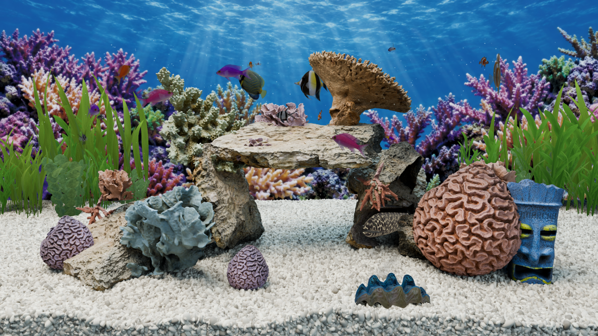
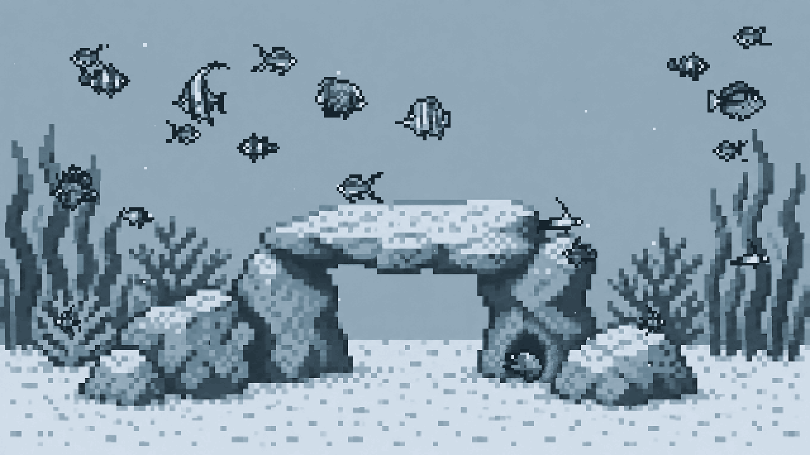

# Omaquarium

A living reef aquarium on your Omarchy desktop. Twenty fish swim a real 3D tank
behind your windows — a moray watching from its cave, plants swaying, bubbles
rising from the tiki — and a fish icon in your bar turns it all on and off.



> **This is a development snapshot.** The aquarium works and is safe to run;
> the reef is still being refined, so expect its look to keep changing.

## Requirements

- Omarchy 4 (the Quickshell desktop)
- A working GPU driver and **Qt Quick 3D**: `omarchy pkg add qt6-quick3d`

Vulkan is used by default, with OpenGL and your system default available in the
plugin's own Graphics control if a machine prefers one of those.

## Install

```sh
omarchy plugin add https://github.com/28allday/omaquarium.git --enable
```

Choose the **right** bar section when asked, and the fish icon appears in your
bar. That is the whole installation — the aquarium starts switched off, so
click the icon and press **Turn on**.

To update later:

```sh
omarchy plugin update nosignal.omaquarium
```

## Using it

Click the fish icon in your bar for the controls. The icon is grey when the
aquarium is off, your accent colour while it is swimming, and amber when it is
paused. **Right-clicking the icon** turns the aquarium on or off without opening
anything.

| Control | What it does |
|---|---|
| **Turn on / Turn off** | Starts and stops the aquarium |
| **Pause / Resume** | Freezes the fish exactly where they are |
| **Shuffle** | Gives every fish fresh starting positions and routes |
| **Bit mode · Game Boy** | Swaps the reef for pixel artwork in your theme colours |
| **Lighting** | Daylight, dusk or moonlight |
| **Speed** | Quarter speed to triple speed |
| **Fish** | 4 to 24 swimmers |
| **Fish size** | Half size to half again as large |
| **Quality** | High, medium or low (see below) |
| **Graphics** | Vulkan, OpenGL, or your system default |
| **Bubbles** | Bursts from the tiki ornament |
| **Water particles** | Fine specks drifting in the current |
| **Pause on fullscreen** | Freezes the tank on a monitor showing a fullscreen window |

**Quality** trades detail for GPU time: high renders the full-resolution scene
at 60 fps, medium three-quarter resolution at 30, low half resolution at 24.
The complete 16:9 tank is always fitted to your display, so the reef keeps its
shape on an ultrawide or a 4:3 panel.

**Bit mode** is a second, hand-drawn pixel scene rather than a filter over the
first — a stone arch, layered foliage, a cave moray and animated fish sprites,
drawn in four shades taken from your active Omarchy theme. Change your theme
and it recolours immediately. Every control still applies, and switching back
restores the reef exactly where you left it.



### From a terminal

```sh
omarchy-shell omaquarium on
omarchy-shell omaquarium off
omarchy-shell omaquarium pause
omarchy-shell omaquarium resume
omarchy-shell omaquarium shuffle
omarchy-shell omaquarium status
omarchy-shell omaquarium lights                 # list the lighting modes
omarchy-shell omaquarium setLighting moonlight
omarchy-shell omaquarium setFish 20             # 4–24
omarchy-shell omaquarium setSize 1.2            # 0.5–1.6
omarchy-shell omaquarium setSpeed 1.5           # 0.25–3
omarchy-shell omaquarium setQuality medium      # low | medium | high
omarchy-shell omaquarium setBackend opengl      # vulkan | opengl | auto
omarchy-shell omaquarium setBitMode true
omarchy-shell omaquarium setBubbles false
omarchy-shell omaquarium setParticles false
omarchy-shell omaquarium setPauseOnFullscreen false
```

## What it does to your machine

The aquarium draws one background surface per monitor, behind every window. The
surfaces accept no clicks or keys and reserve no space, so nothing on your
desktop moves or changes behaviour.

The reef runs in its own process, started when you turn the aquarium on and
stopped when you turn it off — so the desktop shell itself never has to restart
to change the graphics API, and nothing is running when the aquarium is off.

Your settings are saved to `${XDG_STATE_HOME:-~/.local/state}/omaquarium/state.json`
and nothing else on your system is written to or changed. The plugin makes no
network connections.

## Remove

```sh
omarchy plugin remove nosignal.omaquarium
```

That takes the bar icon and the aquarium with it. To clear the saved settings
as well:

```sh
rm -rf "${XDG_STATE_HOME:-$HOME/.local/state}/omaquarium"
```

## Licence and credits

MIT — see [LICENSE](LICENSE). The reef, the animals, the ornaments and the
pixel artwork were all made for this project; [CREDITS.md](CREDITS.md) has the
details.
